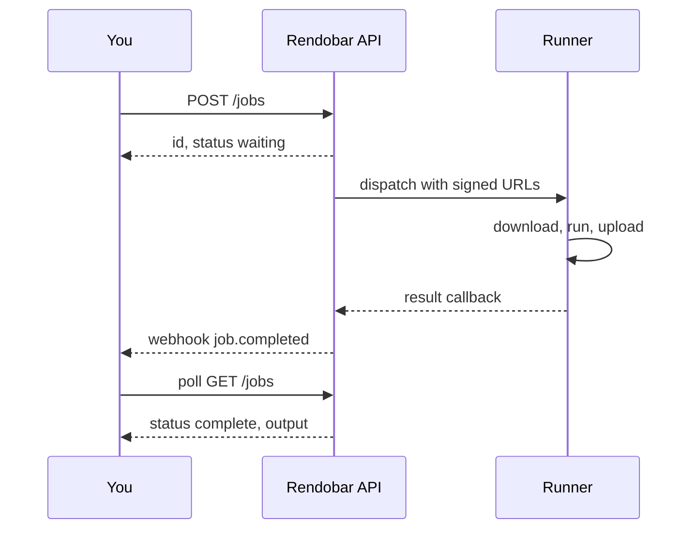
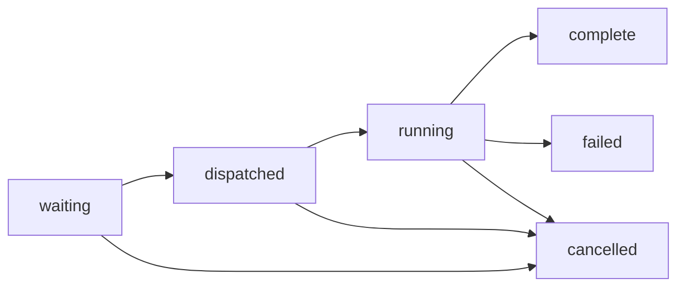

<script
  type="application/ld+json"
  dangerouslySetInnerHTML={{
    __html: JSON.stringify({
      "@context": "https://schema.org",
      "@type": "TechArticle",
      "@id": "https://rendobar.com/docs/concepts/job/#article",
      "headline": "How a job works",
      "description": "Run a job from a typed request, through async execution on our runners, to a signed output. The lifecycle, the statuses, and the output shape, in one place.",
      "datePublished": "2026-06-22",
      "dateModified": "2026-06-22",
      "author": { "@type": "Organization", "@id": "https://rendobar.com/#organization" },
      "publisher": { "@type": "Organization", "@id": "https://rendobar.com/#organization" },
      "isPartOf": { "@id": "https://rendobar.com/#website" }
    })
  }}
/>

A job is one unit of media work. You describe it, submit it, and it runs on its own while you poll or wait for a webhook. Everything on Rendobar is a job, whether that is an FFmpeg command or animated captions. They all submit the same way and they all return the same shape.

Here is the whole round trip:



## The shape of a job

Every job is a `type` plus the `inputs` and `params` that type expects:

```json
{ "type": "ffmpeg", "inputs": { "source": "https://..." }, "params": { "command": "ffmpeg -i source out.mp4" } }
```

`type` picks the operation, `inputs` maps names to source URLs, and `params` carries the options for that type. `POST` it to `/jobs` and you get back an id and a `waiting` status. Each [job type](/jobs/ffmpeg) documents its own `inputs` and `params`.

## The lifecycle

A job moves through six statuses. Three are terminal.



| Status | What it means |
|---|---|
| `waiting` | Saved and queued. The submit gate passed: auth, plan and rate limits, a balance check, and schema validation. |
| `dispatched` | Sent to a runner with presigned URLs for download and upload. |
| `running` | The runner is downloading inputs, running the work, and uploading the result. |
| `complete` | Finished. The `output` is ready. |
| `failed` | Errored. Read `error.code` and `error.message`. |
| `cancelled` | Stopped before it finished. |

On any terminal status the job is billed for the compute it used, and a [webhook](/guides/webhooks) fires if you configured one. A job that never started settles free. Failures carry an `error.code` from the [error catalogue](/support/errors). A job that runs past its plan's time limit fails with `JOB_TIMEOUT` and is billed for the compute it consumed. A job a runner accepted but never started fails with `RUNNER_TIMEOUT` and is not charged. Cancelling a `running` job stops the upstream execution too.

## The output

A `complete` job carries one `output`. The shape is the same for every type, so you never branch on the job type to find the result.

```json
{
  "data": <job-type-specific JSON> | null,
  "file": <File> | null,
  "files": <File>[],
  "expiresAt": <unix ms> | null
}
```

<ResponseField name="data" type="object | null">
  The computed answer for jobs that return one, such as a probe result or a transcript. `null` for jobs that only write files.
</ResponseField>

<ResponseField name="file" type="File | null">
  The headline result you play or download: a single file, or a stream manifest (`.m3u8` / `.mpd`). `null` for data-only jobs and pure file sets. Always one of `files`.
</ResponseField>

<ResponseField name="files" type="File[]">
  Every file the job produced. One entry for a single output, the manifest plus segments for a stream, every member for a set. `[]` for data-only jobs.
</ResponseField>

<ResponseField name="expiresAt" type="integer | null">
  Unix ms when the URLs expire. Re-fetch the job with `GET /jobs/{id}` to mint fresh ones.
</ResponseField>

<Tip>
Expecting one output? Read `output.file.url` and you are done. Handling a job that can write many files (frames, HLS segments, a resolution ladder)? Iterate `output.files`. The two always agree: `file`, when set, is one of `files`.
</Tip>

### The File type

Each entry in `file` and `files` is the same shape:

```json
{
  "url": "https://api.rendobar.com/dl/job_abc123?token=<token>",
  "path": "output.mp4",
  "type": "video",
  "size": 4194304,
  "meta": { "format": "mp4", "width": 1280, "height": 720, "durationMs": 30000 }
}
```

`url` is a signed link that expires at `output.expiresAt`. `path` is the filename the job wrote. `type` is an open enum (`video`, `image`, `audio`, `captions`, `playlist`, `data`, `other`), so tolerate values you do not recognize. `size` is bytes, and `meta` carries probed `format`, `width`, `height`, and `durationMs` when known.

### Four patterns, one shape

Which fields are populated depends on what the job produced.

<Tabs>
<Tab title="Single file">

The common case for transform jobs. `file` is the output, `files` lists it, `data` is null.

```json
{
  "data": null,
  "file": { "url": "https://api.rendobar.com/dl/job_abc123?token=<token>", "path": "output.mp4", "type": "video", "size": 4194304 },
  "files": [
    { "url": "https://api.rendobar.com/dl/job_abc123?token=<token>", "path": "output.mp4", "type": "video", "size": 4194304 }
  ],
  "expiresAt": 1735689600000
}
```

</Tab>
<Tab title="Stream">

An HLS or DASH stream. `file` is the manifest, typed `playlist`. Point a player at `file.url`. `files` carries the manifest plus every segment.

```json
{
  "data": null,
  "file": { "url": "https://api.rendobar.com/v/job_abc123/<token>/master.m3u8", "path": "master.m3u8", "type": "playlist", "size": 412 },
  "files": [
    { "url": "https://api.rendobar.com/v/job_abc123/<token>/master.m3u8", "path": "master.m3u8", "type": "playlist", "size": 412 },
    { "url": "https://api.rendobar.com/v/job_abc123/<token>/seg_000.ts", "path": "seg_000.ts", "type": "video", "size": 1048576 }
  ],
  "expiresAt": 1735689600000
}
```

</Tab>
<Tab title="Set">

An unordered set with no single headline, such as an image sequence or a resolution ladder. `file` is `null`, read `files`.

```json
{
  "data": null,
  "file": null,
  "files": [
    { "url": "https://api.rendobar.com/v/job_abc123/<token>/frame_000.png", "path": "frame_000.png", "type": "image", "size": 204800 },
    { "url": "https://api.rendobar.com/v/job_abc123/<token>/frame_001.png", "path": "frame_001.png", "type": "image", "size": 205120 }
  ],
  "expiresAt": 1735689600000
}
```

</Tab>
<Tab title="Data only">

A job that computes an answer instead of writing files. `data` carries it, the rest are empty.

```json
{
  "data": { "width": 1280, "height": 720, "durationMs": 30000, "codec": "h264", "fps": 30 },
  "file": null,
  "files": [],
  "expiresAt": null
}
```

</Tab>
</Tabs>

### Reading it

The read path is the same every time. No job-type discriminator.

```ts
const { data: job } = await res.json();

if (job.output.data) console.log(job.output.data);   // computed answer
if (job.output.file) console.log(job.output.file.url); // the thing to play or download
for (const f of job.output.files) console.log(f.path, f.type, f.size); // the full list
```

Three invariants hold for every type, so you can code against them: `output.file` is always one of `output.files` (or `null`), `expiresAt` is set whenever `files` is non-empty, and a `complete` job always has `output.data` or `output.files`. It never returns nothing.

## Polling or webhooks

Poll `GET /jobs/{id}` every second or two until the status is terminal, or skip polling entirely: register a [webhook](/guides/webhooks) and Rendobar pushes `job.completed` to your server the moment the job lands.

## See also

- [Webhooks](/guides/webhooks): push status changes instead of polling
- [Credits and billing](/concepts/credits): how the terminal debit works
- [Error codes](/support/errors): every `error.code` a failed job returns
- [FFmpeg](/jobs/ffmpeg): a job type end to end
