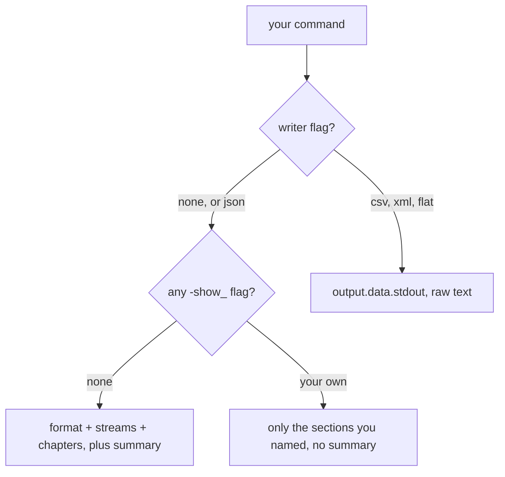

<script
  type="application/ld+json"
  dangerouslySetInnerHTML={{
    __html: JSON.stringify({
      "@context": "https://schema.org",
      "@type": "TechArticle",
      "@id": "https://rendobar.com/docs/jobs/ffprobe/#article",
      "headline": "Probe media metadata",
      "description": "Run ffprobe on a video, audio, or image URL and get a normalized summary plus the full raw report: codec, resolution, duration, fps, rotation, HDR, audio.",
      "datePublished": "2026-07-17",
      "dateModified": "2026-07-21",
      "author": { "@type": "Organization", "@id": "https://rendobar.com/#organization" },
      "publisher": { "@type": "Organization", "@id": "https://rendobar.com/#organization" },
      "isPartOf": { "@id": "https://rendobar.com/#website" }
    })
  }}
/>

You write the `command` and Rendobar runs `ffprobe` as written, the same model as [FFmpeg](/jobs/ffmpeg). A bare media URL is a valid command: the defaults get filled in and you get a normalized `summary` next to the raw `format`, `streams`, and `chapters`.

<Check>
**Live.** Accepts video, audio, and image URLs.
</Check>

<Tip>
From a shell? Use [the CLI](/cli): `rb ffprobe https://example.com/video.mp4`. Local files upload automatically.
</Tip>

## Probe a file

<CodeGroup>

```ts SDK
import { createClient } from "@rendobar/sdk";

const client = createClient({ apiKey: "rb_YOUR_KEY" });

const job = await client.jobs.create({
  type: "ffprobe",
  params: { command: "https://cdn.rendobar.com/assets/examples/sample.mp4" },
});

const done = await client.jobs.wait(job.id);
console.log(done.output.data.summary.kind); // "video"
```

```python Python
import requests, time

base = "https://api.rendobar.com"
headers = {"Authorization": "Bearer rb_YOUR_KEY"}

job = requests.post(
    f"{base}/jobs",
    headers=headers,
    json={
        "type": "ffprobe",
        "params": {"command": "https://cdn.rendobar.com/assets/examples/sample.mp4"},
    },
).json()["data"]

while job["status"] not in ("complete", "failed", "cancelled"):
    time.sleep(1)
    job = requests.get(f"{base}/jobs/{job['id']}", headers=headers).json()["data"]

print(job["output"]["data"]["summary"]["kind"])
```

```bash cURL
curl -X POST "https://api.rendobar.com/jobs" \
  -H "Authorization: Bearer rb_YOUR_KEY" \
  -H "Content-Type: application/json" \
  -d '{
    "type": "ffprobe",
    "params": { "command": "https://cdn.rendobar.com/assets/examples/sample.mp4" }
  }'
# Returns { "data": { "id": "job_...", "status": "waiting" } }.
# Poll GET /jobs/{id} until "status": "complete", then read output.data.
```

</CodeGroup>

A probe is a data job. The answer lands in `output.data`, and `output.file` is `null` because nothing is written. Most probes finish in a few seconds. The SDK's `jobs.wait` polls for you; over raw HTTP, poll `GET /jobs/{id}` or subscribe with [webhooks](/guides/webhooks).

## What comes back

What you ask for decides what you get. Say nothing and Rendobar fills in the defaults; name your own sections or your own writer and it steps aside.



Auto-fill adds only what your command left out:

| You didn't pass | Rendobar adds |
|---|---|
| `-v` or `-loglevel` | `-v error` |
| A writer flag (`-of`, `-print_format`, `-output_format`) | `-print_format json` |
| Any `-show_*` flag | `-show_format -show_streams -show_chapters` |

<Warning>
Auto-fill works by category, not by flag. One `-show_*` of your own suppresses the whole trio, so `-show_frames -read_intervals %+#5` returns `frames` and nothing else. Ask for what you want alongside it:

```
-show_frames -show_format -show_streams -read_intervals %+#5 https://cdn.rendobar.com/assets/examples/sample.mp4
```
</Warning>

Everything else passes through untouched. This picks the primary video stream and reads four fields off it:

```
ffprobe -select_streams v:0 -show_entries stream=codec_name,width,height,r_frame_rate -print_format json https://cdn.rendobar.com/assets/examples/sample.mp4
```

Four things are rejected with `VALIDATION_ERROR` before the job is created: `-protocol_whitelist`, `-protocol_blacklist`, shell control characters (`>`, `|`, `;`), and `-o`/`-output_file`. Output always comes back to you and is never written to a file.

Rendobar reads the URL directly, so a faststart MP4 transfers only its header and a file over your plan's input limit still probes. When a server refuses range requests, the runner downloads the file first and the input limit applies.

## The summary

`summary` normalizes what's awkward to read raw: rotation buried in side data, fractional frame rates, HDR spread across three color fields, cover art masquerading as video. Here is the sample file above, probed:

```json
{
  "kind": "video",
  "container": "mp4",
  "formatLongName": "QuickTime / MOV",
  "durationSec": 5.013,
  "sizeBytes": 352121,
  "bitrateBps": 561932,
  "startTimeSec": 0,
  "streamCounts": { "video": 1, "audio": 1, "subtitle": 0, "data": 0, "attachment": 0 },
  "tags": { "major_brand": "isom", "encoder": "Lavf62.3.100" },
  "video": {
    "codec": "h264",
    "profile": "High",
    "width": 1280,
    "height": 720,
    "displayAspectRatio": "16:9",
    "pixelFormat": "yuv420p",
    "bitDepth": 8,
    "fps": 24,
    "isVariableFrameRate": false,
    "rotation": 0,
    "isHdr": false,
    "bitrateBps": 459337,
    "language": null
  },
  "audio": {
    "codec": "aac",
    "profile": "LC",
    "channels": 2,
    "channelLayout": "stereo",
    "sampleRate": 48000,
    "bitrateBps": 95699,
    "language": null
  }
}
```

Switch on `kind` first. It tells you which block to read:

| `kind` | Extra field | What it means |
|---|---|---|
| `"video"` | `video` (never `null`), `audio` (primary audio stream, or `null`) | A real, non-cover-art video stream is present |
| `"audio"` | `audio` (never `null`) | No video stream, at least one audio stream |
| `"image"` | `image` (never `null`) | A still image: an image container, or a zero-duration file with no audio |
| `"other"` | none | Subtitle-only, data-only, or an attached-pic-only file with no audio track |

Three things it gets right that raw ffprobe doesn't. `video.rotation` is `0`, `90`, `180`, or `270`, read from the display matrix, while `width` and `height` stay as stored, so a portrait phone clip reads 1920×1080 with `rotation: 90`. An MP3 with embedded art reads `kind: "audio"`, because the `attached_pic` stream is excluded from both `streamCounts.video` and `summary.video`. And `video.isHdr` collapses PQ, HLG, and BT.2020 primaries into one boolean, with the exact color fields left in the raw stream.

Fields are `null`, never absent, when a value doesn't apply or ffprobe couldn't read it. `sizeBytes` is `null` when a remote server doesn't report length, and `tags` is `{}` when the container carries none.

<Tip>
Every `summary` field name is stable. Write your checks against `summary.kind` and `summary.video.width` directly.
</Tip>

## Parameters

<ParamField body="command" type="string" required>
  A raw ffprobe command, run as written. Minimal form is the media URL on its own. The `ffprobe` prefix is optional.
</ParamField>

<ParamField body="timeout" type="integer" default="plan maximum">
  Max execution time in seconds. Plan caps apply, same as [FFmpeg](/jobs/ffmpeg#parameters). A probe rarely approaches it.
</ParamField>

## Probe many files

One job probes one file. Submit one job per file and let them run together: probes are exempt from your concurrency limit, so they dispatch at once instead of queueing behind your other work.

```ts
const urls = [
  "https://cdn.rendobar.com/assets/examples/sample.mp4",
  "https://example.com/clip.mov",
  "https://example.com/promo.webm",
];

const summaries = await Promise.all(
  urls.map(async (url) => {
    const job = await client.jobs.create({ type: "ffprobe", params: { command: url } });
    const done = await client.jobs.wait(job.id);
    return done.output.data.summary;
  }),
);
```

## Reading the result

On a JSON run, `output.data` carries `summary` plus every section ffprobe emitted, under ffprobe's own field names:

```json
{
  "summary": { "kind": "video", "container": "mp4", "durationSec": 5.013, "...": "..." },
  "format": {
    "filename": "https://cdn.rendobar.com/assets/examples/sample.mp4",
    "format_name": "mov,mp4,m4a,3gp,3g2,mj2",
    "duration": "5.013000",
    "size": "352121",
    "bit_rate": "561932",
    "tags": { "encoder": "Lavf62.3.100" }
  },
  "streams": [
    { "index": 0, "codec_type": "video", "codec_name": "h264", "width": 1280, "height": 720, "avg_frame_rate": "24/1", "...": "..." },
    { "index": 1, "codec_type": "audio", "codec_name": "aac", "sample_rate": "48000", "channels": 2, "...": "..." }
  ],
  "chapters": []
}
```

Pick a non-JSON writer and you get ffprobe's text verbatim instead, with nothing parsed and no `summary`:

```json
{ "stdout": "format,https://cdn.rendobar.com/assets/examples/sample.mp4,2,0,mov,mp4,m4a,3gp,3g2,mj2,...\n" }
```

`warnings` appears only when there's something to say. Each entry is `{ code, message }`, and you branch on `code`.

| `code` | Meaning |
|---|---|
| `DURATION_UNKNOWN` | The container reports no duration, a common sign of truncation |
| `REPORT_SPILLED` | The report was too large to return inline. On a JSON writer `frames`/`packets` were dropped, on a text writer `stdout` was truncated. Re-run with a narrower `-read_intervals` |

## Errors

Two things are caught before a job exists, so nothing is billed: a malformed `command` (no URL, a blocked flag, a shell redirect) returns `VALIDATION_ERROR`, and a URL that resolves somewhere Rendobar won't fetch from, such as a private address, returns `INPUT_URL_BLOCKED`. Both are 400s on `POST /jobs`.

A probe that fails after it starts carries `error` with `code`, `message`, `detail`, and `retryable`.

| `code` | Meaning |
|---|---|
| `INPUT_UNREADABLE` | The file is corrupt, or a format ffprobe can't read. Never retryable. |
| `INPUT_FETCH_FAILED` | The URL couldn't be fetched. Check `retryable`: a 404 or an expired link is `false`, a timeout or a 5xx is `true`. |

```json
{
  "code": "INPUT_UNREADABLE",
  "message": "ffprobe could not read the input",
  "detail": "Invalid data found when processing input",
  "retryable": false
}
```

Read `error.retryable` rather than mapping codes yourself. A file that probes but looks truncated succeeds with a `DURATION_UNKNOWN` warning instead of failing, so treat a video with `durationSec: null` as suspect.

## See also

- [Job output](/concepts/job#the-output): the output shape every job returns
- [FFmpeg](/jobs/ffmpeg): run a command against the file you probed
- [Webhooks](/guides/webhooks): receive `job.completed` instead of polling
- [Error codes](/support/errors): the full error catalogue
