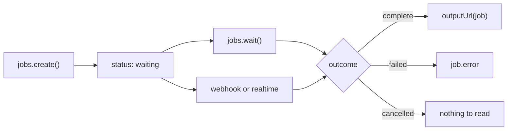

<script
  type="application/ld+json"
  dangerouslySetInnerHTML={{
    __html: JSON.stringify({
      "@context": "https://schema.org",
      "@type": "TechArticle",
      "@id": "https://rendobar.com/docs/sdk/#article",
      "headline": "Use the TypeScript SDK",
      "description": "Submit a job from Node, Deno, Bun, or Workers with @rendobar/sdk, wait for it to finish, and read the signed output URL.",
      "datePublished": "2026-06-22",
      "dateModified": "2026-07-21",
      "author": { "@type": "Organization", "@id": "https://rendobar.com/#organization" },
      "publisher": { "@type": "Organization", "@id": "https://rendobar.com/#organization" },
      "isPartOf": { "@id": "https://rendobar.com/#website" }
    })
  }}
/>

`@rendobar/sdk` is the TypeScript client for the Rendobar API: typed methods, automatic retries, and responses already unwrapped from the `{ data }` envelope. ESM and CommonJS builds run on Node 18+, Deno, Bun, Workers, and the browser.

```bash
npm install @rendobar/sdk
```

```ts title="render.ts"
import { createClient, outputUrl } from "@rendobar/sdk";

const client = createClient({ apiKey: "rb_YOUR_KEY" });

const created = await client.jobs.create({
  type: "ffmpeg",
  params: {
    command: "ffmpeg -i https://example.com/input.mp4 -c:v libx265 -crf 28 output.mp4",
  },
});

const job = await client.jobs.wait(created.id);

if (job.status === "complete") {
  console.log(outputUrl(job)); // signed download URL
}
```

`jobs.create` returns as soon as the job is queued. A job settles on one of three outcomes, and you learn which by polling or by being pushed to.



## Jobs

Every method takes an optional `{ signal }` to abort the request or the `wait` loop.

| Method | Returns |
|---|---|
| `jobs.create({ type, inputs, params })` | `{ id, status: "waiting" }` |
| `jobs.wait(id, options)` | the job once it is `complete`, `failed`, or `cancelled` |
| `jobs.get(id)` | one job |
| `jobs.list({ status, type, limit, offset })` | `{ data, meta }` |
| `jobs.listAll(params)` | async iterator across every page |
| `jobs.cancel(id)` | the cancelled job |
| `jobs.download(id)` | the output as a raw `Response` |
| `jobs.logs(id)` | execution log lines |
| `jobs.types()` | job types available to your org |
| `jobs.stats({ window })` | counts, success rate, and spend over `24h`, `7d`, or `30d` |

`type`, `inputs`, and `params` are per [job type](/jobs/ffmpeg). Pass `idempotencyKey` so a retried request returns the original job instead of a second one.

### Wait

```ts
const job = await client.jobs.wait(created.id, {
  timeout: 600_000,                          // default: the job's own budget
  onProgress: (j) => console.log(j.status),
});
```

`wait` polls until the job is `complete`, `failed`, or `cancelled`, then hands it back. Polling starts at 2s and backs off to 10s. Past the timeout it throws `WaitTimeoutError` carrying the last status seen.

With no `timeout` given, the wait follows the job's own budget (`job.timeoutMs`, your plan's per-job limit) plus grace for upload and callback, so a long job is never reported as timed out while it is still running. Until the server reports that budget the bound is 5 minutes, which is also the floor. Pass a `timeout` to bound the wait yourself. Pass `throwOnFailure: true` to throw `JobFailedError` on a failed or cancelled job instead of returning it.

### Read the output

A `Job` is a union discriminated on `status`. `output` exists only on `complete` and `error` only on `failed`, so narrow before reading either.

```ts
import { outputUrl, jobData } from "@rendobar/sdk";

if (job.status === "complete") {
  outputUrl(job);       // headline URL: the single file, or the HLS/DASH manifest
  job.output.files;     // every file, for frame sequences, segments, or a ladder
  jobData<Probe>(job);  // output.data as Probe | null
} else if (job.status === "failed") {
  console.error(job.error.code, job.error.message, job.error.retryable);
}
```

`outputUrl` is `undefined` for data-only jobs and for file sets with no headline file. `jobData<T>` trusts the `T` you give it, so validate the shape yourself when the input is untrusted. The [output shape](/concepts/job#the-output) is identical for every job type.

## Uploads

`uploads.create` runs the whole asset flow (init, presigned PUT or parallel multipart, complete) and returns the ready `Asset`. Assets expire after 24 hours unless you pass `persist: true`.

```ts
const asset = await client.uploads.create(bytes, { filename: "clip.mp4", persist: true });

await client.jobs.create({
  type: "ffmpeg",
  inputs: { "clip.mp4": asset.url },
  params: { command: "ffmpeg -i clip.mp4 -c:v libx265 output.mp4" },
});
```

Each `inputs` key is the filename staged in the working directory, and the command refers to it by that bare name. `asset.url` resolves to a presigned read at dispatch.

## Webhooks

`webhooks.create({ name, url, subscribedEvents })` registers an endpoint. `rotateSecret`, `test`, `listDeliveries`, and `retryDelivery` operate it.

Verify every delivery with `verifyWebhook`, a zero-dependency entry point that runs anywhere Web Crypto does.

```ts
import { verifyWebhook } from "@rendobar/sdk/webhooks";

const raw = await req.text();
const valid = await verifyWebhook(raw, req.headers, process.env.WEBHOOK_SECRET);
if (!valid) return new Response("invalid signature", { status: 401 });
```

Pass the raw body, never parsed JSON. It checks the HMAC over `${timestamp}.${body}`, rejects deliveries more than 5 minutes old, and accepts the previous secret during the 24-hour rotation window.

## Realtime

`realtime.subscribeJob` streams one job over a WebSocket. `realtime.connect` streams every event in the org.

```ts
const sub = client.realtime.subscribeJob(created.id, {
  onProgress: (e) => console.log(e.progress),
  onComplete: (e) => console.log(e.status),
});

sub.unsubscribe();
```

<Note>
A WebSocket can't carry an `Authorization` header, so the SDK appends your API key to the URL as a query param. Subscribe from your server, not from a browser. First-party browser apps authenticate with the session cookie instead (`credentials: "include"`).
</Note>

## Billing

`billing.state()` returns balance and plan. `billing.usage({ start, end })` totals spend for a window, `billing.usageByClient({ days })` groups that spend by what submitted each job (`dashboard`, `sdk`, `cli`, `mcp`, `n8n`, `api`), and `billing.transactions({ page, limit })` reads the ledger.

`apiKeys`, `assets`, and `orgs` follow the same shape. Organization membership lives on `orgs.members` (`invite`, `changeRole`, `remove`) and `orgs.invitations` (`revoke`). The older `team` resource still works and is marked deprecated.

## Client options

```ts
const server  = createClient({ apiKey: "rb_YOUR_KEY" });   // server side
const browser = createClient({ credentials: "include" });  // first-party browser, cookie auth
```

| Option | Default | Purpose |
|---|---|---|
| `apiKey` | — | `rb_` key from [Settings → API keys](https://app.rendobar.com). Required server-side. |
| `baseUrl` | `https://api.rendobar.com` | API origin. Override for staging. |
| `timeout` | `30000` | Per-request timeout in ms. |
| `maxRetries` | `2` | Retries for 429 and 5xx. |
| `orgId` | — | Default org, sent as `X-Org-Id`. |
| `client` | `"sdk"` | Attribution label, sent as `X-Rendobar-Client`. |
| `debug` | `false` | Log request metadata. |

## Errors

A failed request throws an `ApiError` with `code`, `statusCode`, `message`, `details`, and `retryAfter` on `RATE_LIMITED`. Narrow it with `isApiError`.

```ts
import { isApiError } from "@rendobar/sdk";

try {
  await client.jobs.create({ type: "ffmpeg", params: { command: "ffmpeg -i in.mp4 out.webm" } });
} catch (err) {
  if (isApiError(err)) console.log(err.code, err.statusCode, err.message);
}
```

429 (respecting `Retry-After`) and 5xx retry with backoff before they throw. Every other 4xx throws on the first attempt. The codes are in the [error catalogue](/support/errors).

Every response and param type is exported from `@rendobar/sdk` as a named `type`.

## See also

- [Job types](/jobs/ffmpeg): the type, inputs, and params for every job
- [How a job works](/concepts/job): statuses and the output shape
- [Webhooks](/guides/webhooks): event payloads and delivery retries
- [Error codes](/support/errors): every code a request or job returns
