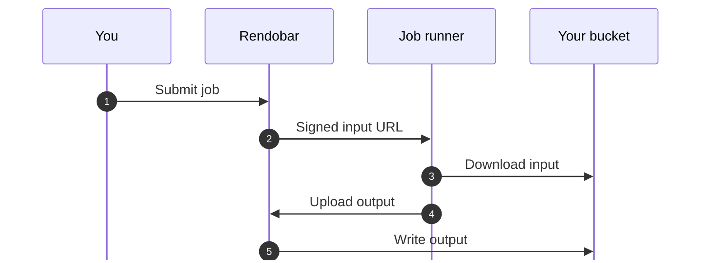
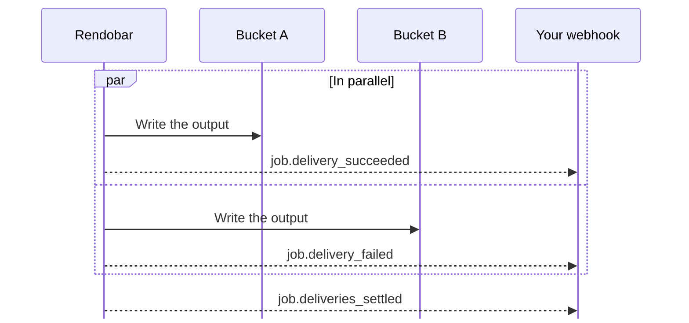

<script
  type="application/ld+json"
  dangerouslySetInnerHTML={{
    __html: JSON.stringify({
      "@context": "https://schema.org",
      "@type": "TechArticle",
      "@id": "https://rendobar.com/docs/storage/#article",
      "headline": "Storage connections",
      "description": "Use your own object storage bucket with Rendobar. Jobs read input files from a connected bucket and write their outputs back to it.",
      "datePublished": "2026-09-12",
      "dateModified": "2026-09-12",
      "author": { "@type": "Organization", "@id": "https://rendobar.com/#organization" },
      "publisher": { "@type": "Organization", "@id": "https://rendobar.com/#organization" },
      "isPartOf": { "@id": "https://rendobar.com/#website" }
    })
  }}
/>

A storage connection links a bucket you own to Rendobar. Jobs read inputs from the bucket and write outputs back to it, so your files never need to be public.

After you connect a bucket, reference objects in it with the connection id you chose:

```text
storage://<connection-id>/<path>
```

<Frame caption="Rendobar reads inputs from connected buckets and writes outputs back to them.">
  
</Frame>

## Supported providers

| Provider | Credentials |
|---|---|
| [Cloudflare R2](/storage/cloudflare-r2) | R2 API token, or access key and secret |
| [Amazon S3](/storage/amazon-s3) | One-click IAM role, which can be read only, or access key and secret |
| [Supabase Storage](/storage/supabase) | Supabase sign-in, or S3 access keys |
| [S3-compatible](/storage/s3-compatible) | Endpoint, region, and access key pair |

Use **S3-compatible** for any service that implements the S3 API, such as MinIO, Backblaze B2, or Wasabi.

## How connections work

A connection has three parts:

| Part | Role |
|---|---|
| Bucket | Where jobs read inputs and write outputs |
| Credential | A key, token, or role that gives Rendobar access. Jobs never receive it |
| Connection id | The name jobs use to reference the bucket |

### Connect a bucket

In [**Storage**](https://app.rendobar.com/storage), select **Connect Storage** and choose your provider. Each [provider page](#supported-providers) covers the credential it needs.

<Frame caption="The Connect Storage dialog.">
  
</Frame>

Before saving the connection, Rendobar writes a test object, reads it back, lists the bucket, and deletes the test object. If a check fails, the connection is not created, and the error names the field or permission to fix.

To run the checks again, select **Test Connection** from the connection's actions menu in [**Storage**](https://app.rendobar.com/storage), or call `client.storage.test(id)`.

### Reference the bucket

Put the connection id in a `storage://` URI, followed by the object's path in the bucket. For example, `storage://demo-bucket/raw/clip.mp4` is the object `raw/clip.mp4` in the connection `demo-bucket`.

Rendobar suggests an id from the bucket name, and any id must match `[a-z0-9-]{2,40}`. Jobs use the id, not the credential, so you can [rotate a credential](#rotate-a-credential) without changing any job.

### Use it in a job

A `storage://` URI works anywhere a job accepts a file URL. Put it in `inputs` to read an object, and in `destinations` to write the output:

```typescript
import { createClient } from "@rendobar/sdk";

const client = createClient({
  apiKey: process.env.RENDOBAR_API_KEY,
});

const job = await client.jobs.run({
  type: "ffmpeg",
  inputs: { source: "storage://demo-bucket/raw/clip.mp4" },
  params: {
    command: "ffmpeg -i source -vf scale=1280:-2 out.mp4",
  },
  destinations: ["storage://demo-bucket/exports"],
});
```

The same URIs work in the [MCP server](/mcp-server). Call `list_storage` to get the connection ids.

In the [Playground](https://app.rendobar.com/playground), you can pick the input and the destination instead of typing URIs.

<Frame caption="An ffmpeg job with its input as a storage:// URI, picked with From Storage, and its output destination under Deliver to.">
  
</Frame>


To pick the input, select **From Storage**, choose a file, then select **Use**.

<Frame caption="Picking an input file from a connected bucket.">
  
</Frame>

To pick where the output goes, select the folder icon (**Browse folders**) on a destination under **Deliver to**, open a folder, then select **Use This Folder**.

<Frame caption="Picking a folder to deliver the output into.">
  
</Frame>

### What happens when the job runs

For the job above, which reads from the bucket and writes back to it:



1. You submit a job that uses `storage://` URIs.
2. Rendobar starts the job and gives the job runner a signed URL for the input. The URL covers one object and expires, so the runner never holds your credential.
3. The job runner downloads the input through the signed URL and runs the job.
4. The job runner uploads the output to Rendobar. This copy is `output.file.url`.
5. Rendobar writes the output to your bucket with the connection's credential. This copy is `deliveries[].url`, and the result is reported as a [delivery event](#delivery-events).

## Delivery settings

Each connection has four delivery settings. To change them, select the connection in [**Storage**](https://app.rendobar.com/storage), then select the edit icon on the **Delivery** card.

<Frame caption="Delivery settings: output path, name conflicts, default destination, and public URL.">
  
</Frame>

### Output path

The output path is a template. New connections use **By date**, which is `rendobar/{date}/{source_name}.{ext}`. The dialog also offers **Flat**, which is `rendobar/{source_name}.{ext}`, and **Custom template**.

| Token | Value |
|---|---|
| `{job_id}` | The job id, such as `job_ee14ffeecc3f4a1b` |
| `{ext}` | The output file extension, without the dot |
| `{source_name}` | The input file name, without its extension |
| `{date}` | The UTC date, as `YYYY-MM-DD` |


The destination in a job decides how much of the template applies. For a connection using **By date**, and an input named `clip.mp4`:

| Destination | Uses | Writes |
|---|---|---|
| `storage://demo-bucket` | The connection's template | `rendobar/2026-09-12/clip.mp4` |
| `storage://demo-bucket/exports` | The folder, then the template's file name | `exports/clip.mp4` |
| `storage://demo-bucket/exports/{job_id}.{ext}` | The path as written | `exports/job_ee14ffeecc3f4a1b.mp4` |

A path that contains a token, or ends in a file name, is used as written. Any other path is treated as a folder.

### Name conflicts

A template without `{job_id}`, including **By date**, can produce a key that already exists. **Name conflicts** decides what happens.

| Setting | Behavior |
|---|---|
| **Keep both** | The default. Appends the last six characters of the job id, so `clip.mp4` is written as `clip-4a1b6e.mp4` |
| **Replace** | Overwrites the existing object |

<Warning>
**Replace** permanently overwrites the existing object unless the bucket has versioning turned on. **Keep both** needs a bucket that supports conditional writes. On a bucket that does not, Rendobar replaces instead.
</Warning>

### Default destination

When **Default destination** is on, jobs that do not set `destinations` write their outputs to this connection. Only one connection per organization can be the default, so turning it on for one connection turns it off for the others.

### Public URL

By default, a delivery's `url` points to Rendobar. Set a public URL to return links on your own host instead, such as `https://media.example.com/exports/clip.mp4`. It must use `https` and cannot point to a private or internal host.

Leave it empty for a private bucket. Inputs and outputs still work, and only the returned `url` changes.

## Delivery results

A completed job lists one entry in `deliveries` for each destination:

```json
{
  "deliveries": [
    {
      "storageId": "demo-bucket",
      "status": "delivered",
      "path": "exports/clip.mp4",
      "url": "https://media.example.com/exports/clip.mp4"
    }
  ]
}
```

| Field | Description |
|---|---|
| `storageId` | The connection id |
| `status` | `pending`, `delivered`, or `failed` |
| `path` | The key written, after the template and any rename |
| `url` | The public URL if one is set, otherwise a Rendobar URL |
| `reason` | Why the delivery failed. Present only when `status` is `failed` |
| `renamed` | `true` when **Keep both** added a suffix |

`output.file.url` and `deliveries[].url` point to the same content. The first is a Rendobar URL that expires at `output.expiresAt`. The second points to the copy in your bucket, which Rendobar does not delete.

`deliveries` is returned by `GET /jobs/{id}`. It is not in the job list response, and it is absent when a job has no destinations.

In the dashboard, a job's **Deliveries** section shows each destination's status and failure reason, and **Retry Failed** retries the failed ones.

<Frame caption="A job's deliveries: one delivered, one in progress, and one failed with its reason.">
  
</Frame>

### Delivery events

A job is `complete` before its deliveries start, and a failed delivery does not change the job's status. Webhooks can arrive in any order, including `job.completed`.



Wait for `job.deliveries_settled` to know every destination is done. It is sent once, after the last destination resolves, and carries every outcome, so the order of the other events does not matter. It is the only delivery event a per-job `callback.url` receives. Jobs with no destinations do not send it.

To retry failed deliveries, call `client.jobs.retryDeliveries(id)` or `POST /jobs/{id}/deliveries/retry`.

## Delivery errors

A failed delivery includes one of these `reason` codes. Rendobar never forwards the bucket's own error text.

| Reason | Cause | Fix |
|---|---|---|
| `destination_denied` | The credential cannot perform this operation on the bucket or path | Grant read and write access to objects in this bucket |
| `signature_mismatch` | The bucket rejected the request signature | Check the access key, secret, and region, or issue a new credential |
| `bucket_not_found` | No bucket with that name exists at the endpoint | Reconnect using the bucket's current name |
| `already_exists` | An object already exists at that key | Add `{job_id}` to the output path, or use **Keep both** |
| `object_too_large` | The bucket rejected the object as too large | Check the bucket's object size limit, or reduce the output size |
| `destination_unavailable` | The bucket returned a 429 or 5xx, did not respond, or an attempt stopped without finishing for 30 minutes | Rendobar retries automatically. Retry manually if it stays failed |
| `not_deliverable` | The job produced no file | Expected for jobs that return data only, such as `ffprobe` |

Errors returned when you create a connection are listed in [error codes](/support/errors).

## Credentials

For connections that use keys, Rendobar stores the access key and secret, encrypted with AES-256-GCM. No API endpoint returns them. A one-click AWS role stores no keys, because Rendobar assumes the role when it needs access.

Some providers issue a different kind of credential, such as a Cloudflare R2 API token. Rendobar uses it once to get an S3 key pair, then discards it. A Supabase sign-in is used once to read the project's API keys, then discarded. See [what Rendobar stores](/storage/supabase#what-rendobar-stores) for Supabase.

### Rotate a credential

Select **Replace Keys** from the connection's actions menu in [**Storage**](https://app.rendobar.com/storage), or call `client.storage.update(id, { credentials })`. Rendobar runs the access checks on the new credential before saving it. The connection id stays the same.

### Revoke access

Delete the token, key, or role in the provider's console. The connection stops working immediately.

Deleting a Rendobar connection also stops access, but it does not invalidate the credential. If you use the credential anywhere else, revoke it at the provider too.

## SDK methods

| Method | Description |
|---|---|
| `client.storage.list()` | List the connections in the organization |
| `client.storage.get(id)` | Get one connection |
| `client.storage.create(params)` | Connect a bucket. Fails if an access check fails or the id is taken |
| `client.storage.update(id, params)` | Replace the credential or change delivery settings |
| `client.storage.test(id)` | Run the access checks again |
| `client.storage.listObjects(id, params)` | List folders and objects in the bucket |
| `client.storage.stats(id)` | Get delivery activity for the connection |
| `client.storage.delete(id)` | Remove the connection. The bucket is not changed |

## Related resources

<CardGroup cols={2}>
  <Card title="Cloudflare R2" icon="cloudflare" href="/storage/cloudflare-r2">
    Connect an R2 bucket with an API token or an access key pair.
  </Card>
  <Card title="Amazon S3" icon="aws" href="/storage/amazon-s3">
    Connect an S3 bucket with a one-click IAM role or an access key pair.
  </Card>
  <Card title="Supabase Storage" icon="bolt" href="/storage/supabase">
    Connect a Supabase bucket by signing in or with S3 access keys.
  </Card>
  <Card title="S3-compatible" icon="server" href="/storage/s3-compatible">
    Connect MinIO, Backblaze B2, Wasabi, or any other S3-compatible bucket.
  </Card>
  <Card title="Jobs" icon="play" href="/concepts/job">
    Where `inputs` and `destinations` appear in the job payload.
  </Card>
  <Card title="Webhooks" icon="bell" href="/guides/webhooks">
    Receive an event when a job completes.
  </Card>
  <Card title="Errors" icon="triangle-exclamation" href="/support/errors#storage-connections">
    Error codes returned when you create or test a connection.
  </Card>
  <Card title="MCP server" icon="robot" href="/mcp-server">
    List connections with `list_storage` and use them from an agent.
  </Card>
</CardGroup>

## Guides with measured results

<CardGroup cols={2}>
  <Card title="Save FFmpeg output to S3" icon="file-export" href="https://rendobar.com/blog/ffmpeg-output-to-s3/">
    Three ways to get output into a bucket, and what pipe-safe MP4 flags cost.
  </Card>
  <Card title="Process video from an S3 bucket" icon="clock" href="https://rendobar.com/blog/process-s3-video-ffmpeg/">
    Run past Lambda's 900-second limit with a storage input.
  </Card>
  <Card title="Thumbnails from S3 uploads" icon="image" href="https://rendobar.com/blog/video-thumbnail-s3-upload/">
    Trigger a thumbnail job from an S3 event without black frames or duplicates.
  </Card>
  <Card title="Video APIs that deliver to your bucket" icon="table" href="https://rendobar.com/blog/video-api-output-to-your-bucket/">
    13 services compared on keys, roles, and reading inputs from your bucket.
  </Card>
</CardGroup>
